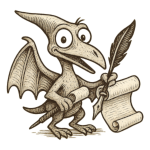

# Pandoctylus



A crazy and opinionated way of generating documents.

## Installation

```bash
pip install pandoctylus
```

## Development

This project uses modern Python packaging with `pyproject.toml`. To set up the development environment:

1. Clone the repository:

```bash
git clone https://github.com/yourusername/pandoctylus.git
cd pandoctylus
```

2. Create a virtual environment and install development dependencies:

```bash
uv venv pandoctylus-venv
source .pandoctylus-venv/bin/activate 
uv pip install -e ".[dev]"
```

3. Run tests:
```bash
pytest
```

## Features

- Generate multiple documents from shared Markdown and YAML and a docx template.

## License

MIT License 
